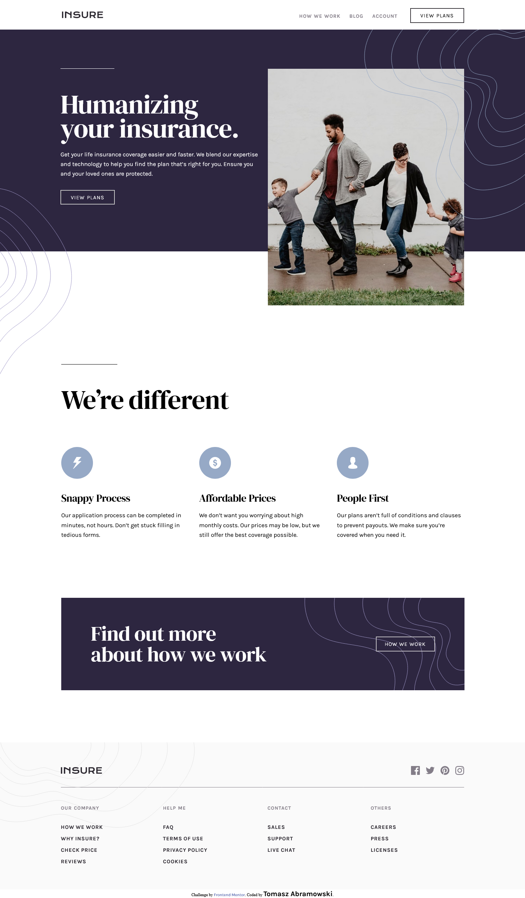

# Frontend Mentor - Insure landing page solution

This is a solution to the [Insure landing page challenge on Frontend Mentor](https://www.frontendmentor.io/challenges/insure-landing-page-uTU68JV8). Frontend Mentor challenges help you improve your coding skills by building realistic projects. 

## Table of contents

- [Overview](#overview)
  - [The challenge](#the-challenge)
  - [Screenshot](#screenshot)
  - [Links](#links)
- [My process](#my-process)
  - [Built with](#built-with)
  - [What I learned](#what-i-learned)
  - [Continued development](#continued-development)
- [Author](#author)

## Overview

### The challenge

Users should be able to:

- View the optimal layout for the site depending on their device's screen size
- See hover states for all interactive elements on the page

### Screenshot

### Links

- Solution URL: [https://github.com/TomaszAbramowski/insure-landing-page](https://github.com/TomaszAbramowski/insure-landing-page)
- Live Site URL: [https://tomaszabramowski.github.io/insure-landing-page/](https://tomaszabramowski.github.io/insure-landing-page/)

## My process

### Built with

- Semantic HTML5 markup
- CSS custom properties
- Flexbox
- CSS Grid
- Mobile-first workflow
- SCSS
- JavaScript
- Jekyll

### What I learned

- SCSS media query
- Basic of animations and that I have to use visibility and opacity to make transitions works
- How to convert a site to Jekyll
- Responsive image
- Bundle file with webpack for Jekyll(JavaScript)

### Continued development
This was my first project for "Frontend Mentor" website.
I'm going to make two more websites like this one to be able to feel comfortable with the basics. 

## Author

- Frontend Mentor - [Tomasz Abramowski](https://www.frontendmentor.io/profile/TomaszAbramowski)
- Twitter - [Tomasz Abramowski](https://www.twitter.com/TomaszAbramows5)

